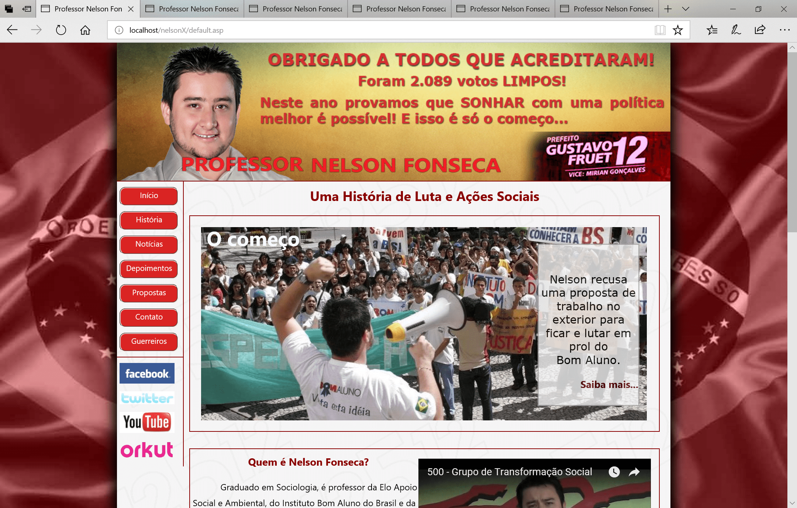
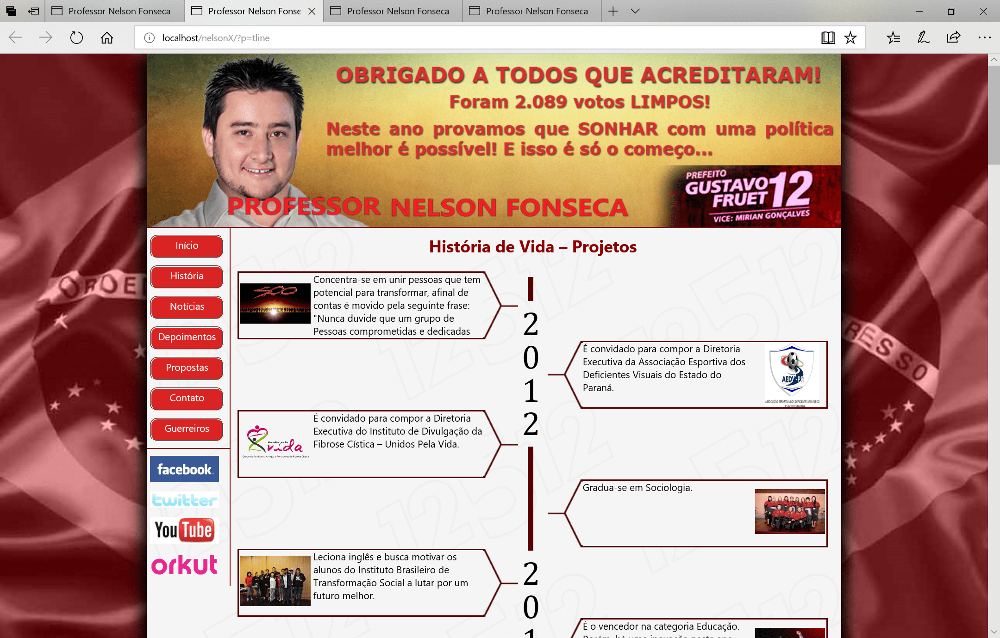
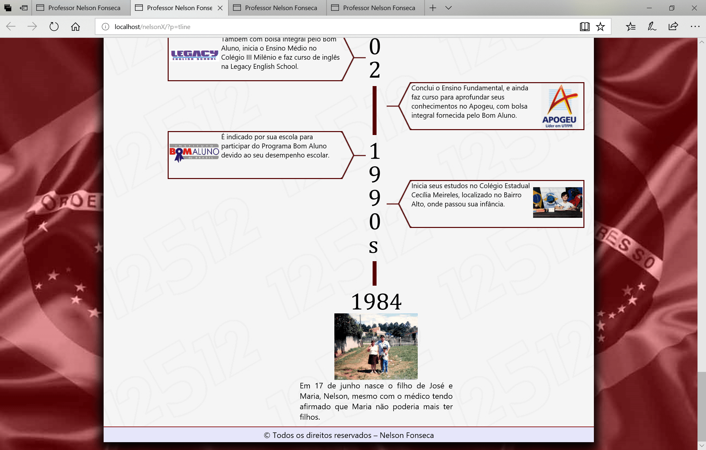
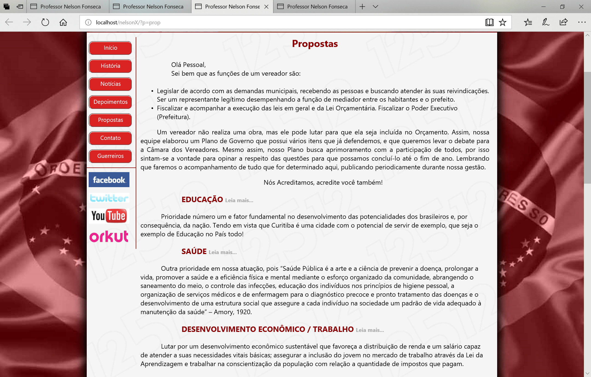
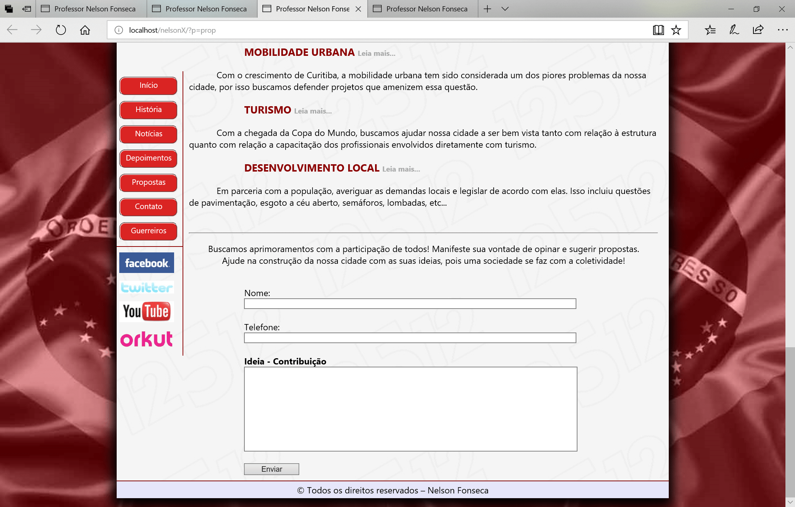

# Nelson Fonseca 12512

Website institucional para divulgação da campanha eleitoral do candidato a vereador de Curitiba Nelson Fonseca. Objetiva expor as propostas, histórico de vida e demais informações do candidato com fotos, fornecer acesso
às suas mídias sociais e abrir canal de comunicação com os eleitores.

  Funcionalidades:
  <ul>
    <li>Conter informações institucionais do candidato;</li>
    <li>Linha do tempo com marcos relevantes de sua carreira;</li>
    <li>Integração com vídeos e redes sociais;</li>
    <li>Formulários de contato para mensagens.</li>
  </ul>

 

  
  
  
  
  
  

  <i>Desenvolvido por Rodrigo Chin. 2012</i>

